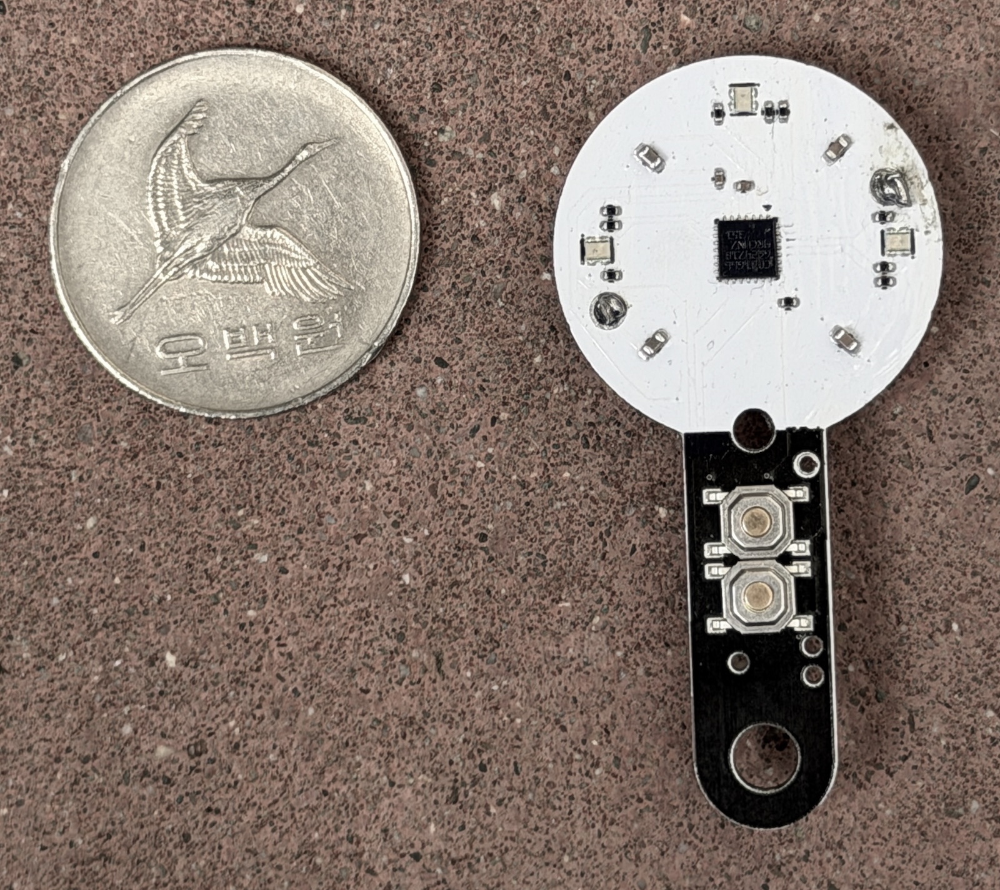
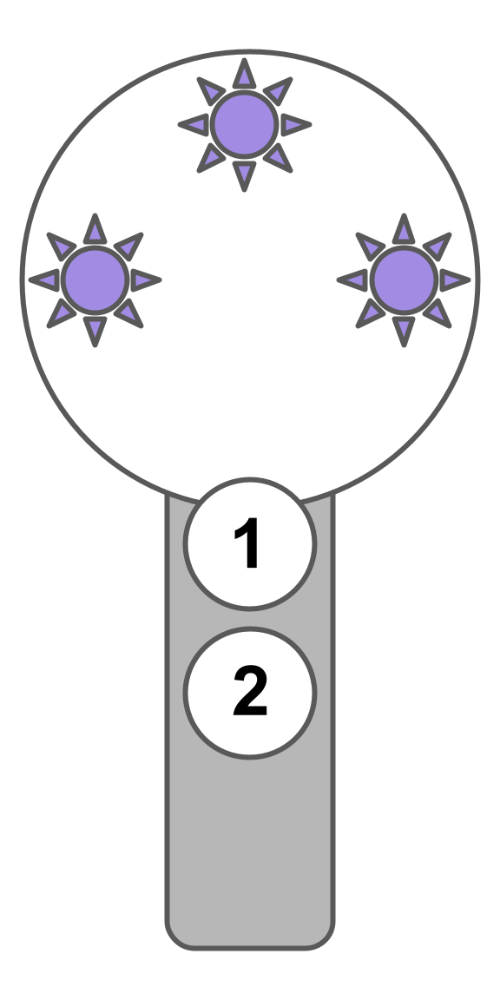
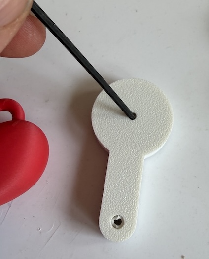
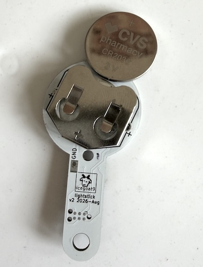
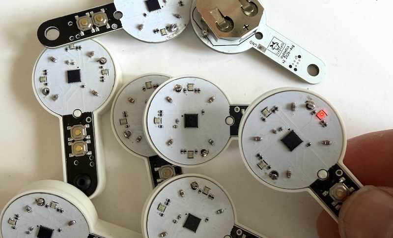

If you're here, you're probably one of a handful of people with the “keychain K-pop lightstick”, a small custom circuit board made by an ARMY Husband for his partner and friends before a series of shows. It's in a small 3D printed case, or you can remove the case and put it on
a keychain or clip through the hole at the bottom.

## Overview

<table><tr><td>

</td><td>

<b>Button 1</b>-- change pattern:
<ol>
<li>side-to-side fade</li>
<li>cosmic twinkle</li>
<li>triple beat</li>
</ol>

<b>Button 2:</b>
<ul>
<li>Turn on (press and hold)</li>
<li>Change color (most modes)</li>
<li>Sync beat* (in beat mode)</li>
</ul>

To save battery, it turns itself off after ~30 seconds, or you can press and hold Button 1 to force it off.
</td></tr></table>

### Sync Beat special mode

There’s no microphone or Bluetooth on this so it can’t automatically sync to music, but if you’re in 
Triple Beat mode (the one where all three LEDs flash at once), you can press
Button 2 at least four times a row in sync with the music, and the device will
adjust its flashing speed to match that rhythm.

After you press Button 2 four times and let go, the device will show you
a quick green double-flash if it was able to match that beat, or a red double-flash
if it doesn’t think you pressed the button at a consistent rhythm.

### Maintenance

The device has an automatic low-power sleep mode so the battery should last a very
long time when not being used (you don't have to remove the battery for storage).
If you do want to replace the battery, remove the front screw with a 2mm hex key,
then shake the circuit board out of its shell (if it’s stuck, you can push it out
of the enclosure through the central rear hole).
It uses a common CR2032 coin cell. Be sure to insert + side up!

**Disclaimer:**
This is not a product, it’s a small batch prototype as giveaways for a concert, 
so it will not last forever-- exposed components could get damaged, it's sensitive to
static, and it’s certainly not waterproof!

### Nerd Notes

All the electronics except the battery are visible on the front. The square in
the center is the [STM32C031](https://www.st.com/en/microcontrollers-microprocessors/stm32c031c4.html), 
a modern low-cost (under $1) microprocessor built from a few million transistors, which runs all the code.

I plan to put the PCB design files and source code online here at some point,
once I clean them up. If one of the handful of people who gets this is an engineer and you
want to reprogram yours, just reach out.

